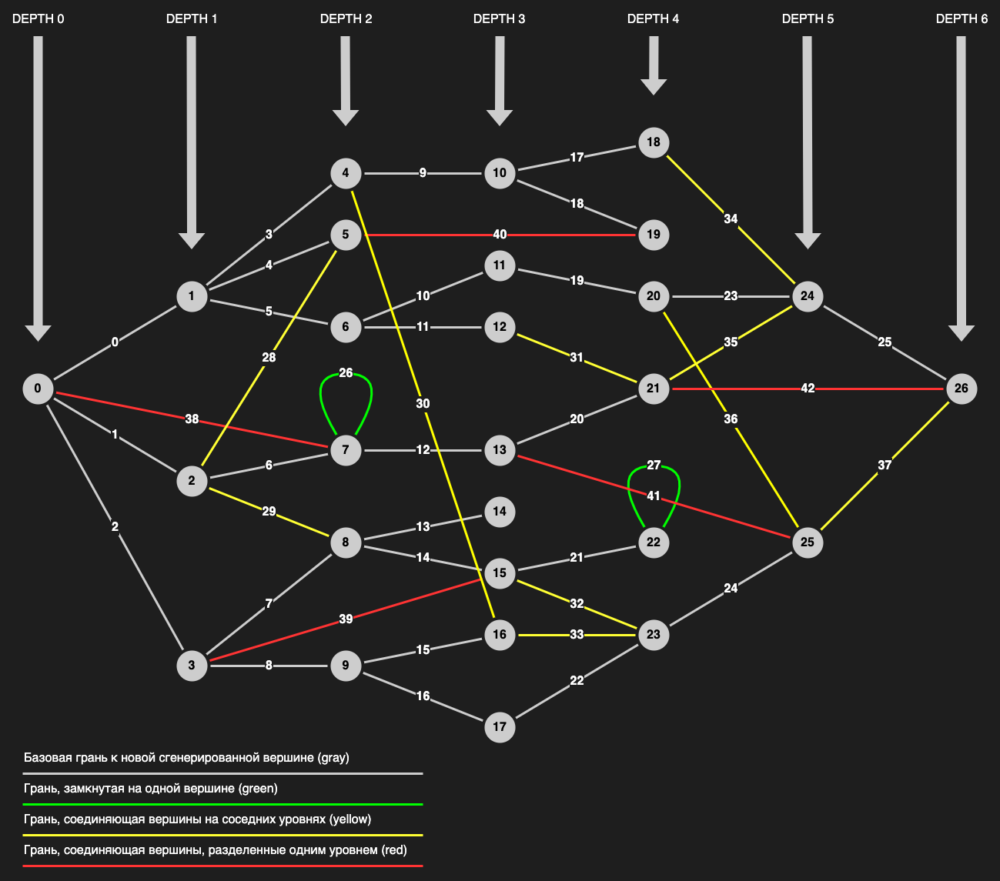

# Задача 4

# 1. Доработать генерацию графа

## Входные параметры

Ваша программа должна запрашивать у пользователя следующие параметры:
- `depth`: Максимальная глубина графа (`int` от 0 и до бесконечности).
- `new_vertices_count`: Количество новых генерируемых вершин из каждой вершины графа (`int` от 0 и до бесконечности).

Входные параметры нужно валидировать и, в случае ошибки, информировать об этом пользователя, после чего запрашивать данные повторно.

Так как новые вершины и грани у нас будут генерироваться с определенной вероятность, может быть ситуация, когда финальная глубина графа будет ниже заданной пользователем.

## Выделить генерацию графа в отдельный класс

Создать для глубины отдельный тип внутри класса `Graph`:
```cpp
class Graph {
  using Depth = int;
};
```

Так как генерация графа становится все больше и сложнее, имеет смысл отделить её в отдельную сущность:
```cpp
class GraphGenerator;
```

А так же объединить входные параметры в структуру, которая содержит в себе параметры генерации:
```cpp
struct GraphGeneration::Params;
```

Интерфейс для взаимодействия с генератором должен быть следующий:
```cpp
class GraphGenerator {
 public:
  struct Params {
   public:
    explicit Params(Graph::Depth depth = 0, int new_vertices_count = 0) :
      depth_(depth), new_vertices_count_(new_vertices_count) {}

    Graph::Depth depth() const { return depth_; }
    int new_vertices_count() const { return new_vertices_count_; }

   private:
    Graph::Depth depth_ = 0;
    int new_vertices_count_ = 0;
  };

  explicit GraphGenerator(const Params& params = Params()) : params_(params) {}

  Graph generate() const {
    auto graph = Graph();
    graph.add_vertex();
    generate_grey_edges(graph);
    generate_green_edges(graph);
    generate_yellow_edges(graph);
    generate_red_edges(graph);
  }

 private:
  const Params params_ = Params();
};
```

## Новые вершины будут генерироваться с определенной вероятностью

- Пример, если `depth = 2` и `new_vertices_count = 3`:
  - Глубина графа 0:
    - 100% каждая вершина на этой глубине сгенерирует 3 новых.
  - Глубина графа 1:
    - 50% каждая вершина на этой глубине сгенерирует 3 новых.
  - Глубина графа 2:
    - 0% каждая вершина на этой глубине сгенерирует 3 новых.

- Пример, если `depth = 4` и `new_vertices_count = 5`:
  - Глубина графа 0:
    - 100% каждая вершина на этой глубине сгенерирует 5 новых.
  - Глубина графа 1:
    - 75% каждая вершина на этой глубине сгенерирует 5 новых.
  - Глубина графа 2:
    - 50% каждая вершина на этой глубине сгенерирует 5 новых.
  - Глубина графа 3:
    - 25% каждая вершина на этой глубине сгенерирует 5 новых.
  - Глубина графа 4:
    - 0% каждая вершина на этой глубине сгенерирует 5 новых.

То есть, вероятность на 0ой глубине всегда 100%, а на последней глубине всегда 0%.
Между ними вероятность должна изменяться с равным шагом.

Говоря "вершина генерирует новую вершину", я подразумеваю, что в граф добавляется новая вершина и грань, соединяющая эти две вершины.

"... каждая вершина на этой глубине сгенерирует N новых", вы можете думать об этом как:
каждая вершина имеет N попыток сгенерировать новую вершину с такой-то вероятностью.

## После того, как вершины сгенерированы, между ними могут быть добавлены дополнительные грани

- **Зеленая**: 10% что у вершины будеть грань сама на себя.
- **Желтая**: Вершина будет соединена с рандомной вершиной, находящейся на 1 уровень глубже, исключая её собственных потомков.
  - Вероятность обратная к обычным (серым) граням, с учетом сдвига на одну глубину:
    - Глубина графа 0: 0%
    - . . .
    - Глубина графа N-1: 100%
- **Красная**: 33% что вершина будет соединена с рандомной вершиной, находящейся на 2 уровня глубже.

## Дополнительная информация

1\) Для реализации логики разных цветов граней - существует специальный инструмент - "перечисление" (по-английски "enumeration").
Соответственно у нас есть тип данных `Color`, в котором мы перечисляем набор опций: `Grey`, `Green`, `Yellow`, `Red`.
Делается это при помощи `enum class`:

```cpp
struct Edge {
  enum class Color { Grey, Green, Yellow, Red };
}
```

Находиться ему лучше внутри `Edge`, так как это не абстрактный цвет, а объект, реализующий специфическую для `Edge` логику.
Обратите вниманием что в `C++` используется `enum color`, тогда как в `C` - просто `enum`.
`enum color` лучше, так как он позволяет избежать автоматического приведения типов, что делает код надежней и позволяет компилятору отловить ошибки на ранней стадии.

Для перевода `Edge::Color` в строку, расширьте логику `printing`:
```cpp
namespace printing {

std::string print_edge_color(const Edge::Color& color) const;

}  // namespace printing
```

2\) По дизайну, любая новая вершина в графе, которая не связани ни с одной другой вершиной, находится на глубине 0.
При добавлении новой грани между вершинами, соотвественно изменяется глубина.
Глубина вершины вычисляется как минимальное количество шагов от начала графа до данной вершины.
Вычислять глубину вершины - ответственность графа, она не должна перекладываться на внешнего пользователя.
То же относится и к вычислению цвета грани. Публичный интерфейс графа должен оставаться неизменным.

```cpp
Vertex& add_vertex();
Edge& add_edge(VertexId from_vertex_id, VertexId to_vertex_id);
```

Вычислять глубину вершины и цвет граней нужно динамически, внутри графа, без перекладывания этой ответственности на внешнего пользователя.

Для упрощения, примем то, что глубина графа изменяется только серыми гранями. Думайте о них, как о базовых грянях.
Все остальные грани (зеленая, желтая и красная) никак не влияют на глубину графа, и являются дополнительными гранями.

Соответственно логика должна быть следующая (псевдокод):
- Глубина:
  - ```cpp
    const auto from_vertex_depth = get_vertex_depth(from_vertex_id);
    set_vertex_depth(to_vertex_id, from_vertex_depth + 1);
    ```
- Цвет:
  - ```cpp
    const auto from_vertex_depth = get_vertex_depth(from_vertex_id);
    const auto to_vertex_depth = get_vertex_depth(to_vertex_id);
    if (from_vertex_id == to_vertex_id) {
      return Edge::Color::Green;
    }
    if (get_edges(to_vertex_id).size() == 0) {
      return Edge::Color::Grey;
    }
    if (to_vertex_depth - from_vertex_depth == 1 &&
        !is_connected(from_vertex_id, to_vertex_id)) {
      return Edge::Color::Yellow;
    }
    if (to_vertex_depth - from_vertex_depth == 2) {
      return Edge::Color::Red;
    }
    throw std::runtime_error("Failed to determine color");
    ```

3\) Для определения вероятностей - почитайте про [`std::bernoulli_distribution`](https://en.cppreference.com/w/cpp/numeric/random/bernoulli_distribution).
Оно реализует именно ту логику, которая нам необходима.

## Визуализация примера графа



Данная визуализация очень упрощена и дана только как пример. Ваш граф может, и должен отличаться от нарисованного выше.

# 2. Доработать `JSON` репрезентацию
```json
{
  "depth": 6,
  "vertices": [
    {
      "id": 0,
      "edge_ids": [0, 1, 2, 43],
      "depth": 0
    },
    "..."
  ],
  "edges": [
    {
      "id": 0,
      "vertex_ids": [0, 1],
      "color": "grey"
    },
    "..."
  ]
}
```

- Возможные цвета граней: `grey`, `green`, `yellow`, `red`.
- Пример файла можете посмотреть здесь: [graph.json](graph.json).

## Функция `main` вашей программы

```cpp
// ... some other logic ...

int main() {
  const int depth = handle_depth_input();
  const int new_vertices_count = handle_new_vertices_count_input();

  const auto params = GraphGenerationParams(depth, new_vertices_count);
  const auto generator = GraphGenerator(params);
  const auto graph = generator.generate();

  const auto graph_json = printing::json::print_graph(graph);
  std::cout << graph_json << std::endl;
  write_to_file(graph_json, "graph.json");

  return 0;
}
```

# Содержание `Pull Request`

- `*.cpp` и/или `*.hpp` исходные файлы.
- `graph.json` результат выполнения программы.
- `makefile` по желанию.

# Время Выполнения

1 Неделя.

# Полезные ссылки
- [Graph Depth](https://en.wikipedia.org/wiki/Tree-depth)
