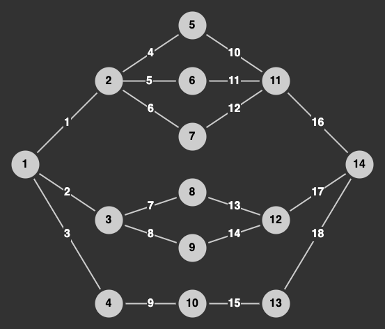

# Задача 2

## 1. Написать генератор графа.

### Параметры графа:
- И вершины и грани могут иметь дополнительную информацию.
  - В частности, пусть у них будет поле `id`
- Неориентированный, можно двигаться в любом направлении.
- Без разъединенных участков, т.е. от первой вершины можно добраться до любой другой.
- Вершина может быть соединена с самой собой.

Интерфейс и имплементация за вами, дерзайте!
Сторонние библиотеки использовать запрещено, нужно все реализорвать с помощью стандартных инструментов.

### Визуализация графа, который вы должны сгенерировать:


> Визуализация дана только для лучшего понимания задачи, вам ничего рисовать не нужно.

## 2. Реализовать текстовый вывод графа в файл в формате `JSON`:
```json
{
  "vertices": [
    {
      "id": 0,
      "edge_ids": [0, 1, 2]
    }, {
      "id": 1,
      "edge_ids": [3, 4, 5]
    },
    "..."
  ],
  "edges": [
    {
      "id": 0,
      "vertex_ids": [0, 1]
    }, {
      "id": 1,
      "vertex_ids": [0, 2]
    },
    "..."
  ]
}
```

Можно в одну строку и даже без пробелов, как душе угодно, главное, чтобы структура совпадала и `JSON` был валидный:
```json
{ "vertices": [ { "id": 0, "edge_ids": [0, 1, 2] }, "..." ], "edges": [ { "id": 0, "vertex_ids": [0, 1] }, "..." ] }
```

## 3. Создать `Pull Reques` по аналогии с первой задачей.

В дальнейших задачах я не буду писать про создание `Pull Request`'ов. Просто запомните, что для каждой задачи у вас должен быть создан отдельный `Pull Request`.

# Время Выполнения

2 Недели

# Количество Баллов

Вовремя:
- 20 Баллов

# Полезные ссылки:
- [Graph Theory](https://en.wikipedia.org/wiki/Graph_theory)
- [JSON](https://en.wikipedia.org/wiki/JSON)
