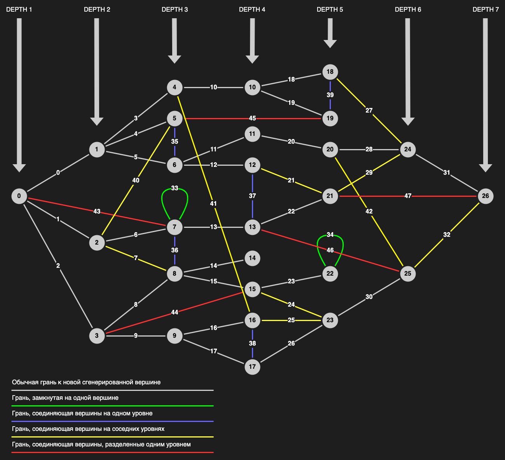

# Задача 3

# 1. Доработать генерацию графа

## Входные параметры:

Ваша программа должна запрашивать у пользователя следующие параметры:
- `depth`: Глубина графа (`int` от 0 и до бесконечности).
- `new_vertices_num`: Количество новых генерируемых вершин из каждой вершины графа (`int` от 0 и до бесконечности).

## Новые вершины будут генерироваться с определенной вероятностью:

- Пример, если `depth = 2` и `new_vertices_num = 3`:
  - Глубина графа 0:
    - 100% каждая вершина на этой глубине сгенерирует 3 новых.
  - Глубина графа 1:
    - 50% каждая вершина на этой глубине сгенерирует 3 новых.
  - Глубина графа 2:
    - 0% каждая вершина на этой глубине сгенерирует 3 новых.

- Пример, если `depth = 4` и `new_vertices_num = 5`:
  - Глубина графа 0:
    - 100% каждая вершина на этой глубине сгенерирует 5 новых.
  - Глубина графа 1:
    - 75% каждая вершина на этой глубине сгенерирует 5 новых.
  - Глубина графа 2:
    - 50% каждая вершина на этой глубине сгенерирует 5 новых.
  - Глубина графа 3:
    - 25% каждая вершина на этой глубине сгенерирует 5 новых.
  - Глубина графа 4:
    - 0% каждая вершина на этой глубине сгенерирует 5 новых.

То есть, вероятность на 0ой глубине всегда 100%, а на последней глубине всегда 0%.
Между ними вероятность должна изменяться с равным шагом.

Говоря "вершина генерирует новую вершину", я подразумеваю, что в граф добавляется новая вершина и грань, соединяющая эти две вершины.

"... каждая вершина на этой глубине сгенерирует N новых", вы можете думать об этом как:
каждая вершина имеет N попыток сгенерировать новую вершину с такой-то вероятностью.

## После того, как вершины сгенерированы, между ними могут быть добавлены дополнительные грани:

- **Зеленая**: 10% что у вершины будеть грань сама на себя.
- **Синяя**: 25% что соседние вершины, находящиеся на одной глубине, будут соединены.
- **Желтая**: Вершина будет соединена с рандомной вершиной, находящейся на 1 уровень глубже.
  - Вероятность обратная к обычным (серым) граням:
    - Глубина графа 0: 0%
    - . . .
    - Глубина графа N: 100%
- **Красная**: 33% что вершина будет соединена с рандомной вершиной, находящейся на 2 уровня глубже.

## Визуализация примера графа:



Данная визуализация очень упрощена и дана только как пример. Ваш граф может, и должен отличаться от нарисованного выше.

# 2. Доработать `JSON` репрезентацию:
```json
{
  "depth": 6,
  "vertices": [
    {
      "id": 0,
      "edge_ids": [0, 1, 2, 43],
      "depth": 0
    },
    "..."
  ],
  "edges": [
    {
      "id": 0,
      "vertex_ids": [0, 1],
      "color": "gray"
    },
    "..."
  ]
}
```

- Возможные цвета граней: `gray`, `green`, `blue`, `yellow`, `red`.

# 3. Генерировать множество графов

- Написать программу, которая последовательно генерирует 10 графов.
- Запрашивать входные параметры только 1 раз, и использовать их для всех графов.
- Для каждого графа создавать отдельный `JSON` файл.

# 4. Добавить Логирование

1. Написать `Logger`, который будет выводить следующую информацию в консоль и в файл:
    ```
    time: Graph 1, Generation Started
    time: Graph 1, Generation Ended {
      depth: number,
      new_vertices_num: number,
      vertices: count, [depth_0_count, depth_1_count, ...],
      edges: count, {gray: count, green: count, blue: count, yellow: count, red: count}
    }
    ```
1. Файл создавать внутри поддиректории `temp`.
    - Пример:
      - `/task_dir_name/name_surname/temp`
1. `JSON` файл переместить туда же.
1. Добавить эту директорию в `.gitignore`.

# Содержание `Pull Request`

- `*.cpp` и/или `*.hpp` исходные файлы.
- Скомпилированный бинарник.
- Изменения в `/.gitignore`.

# Рабочая директория:

`/02_knight_and_princess/*`

# Время Выполнения

2 Недели

# Количество Баллов

Вовремя
- 20 Баллов

# Полезные ссылки:
- [Graph Depth](https://en.wikipedia.org/wiki/Tree-depth)
